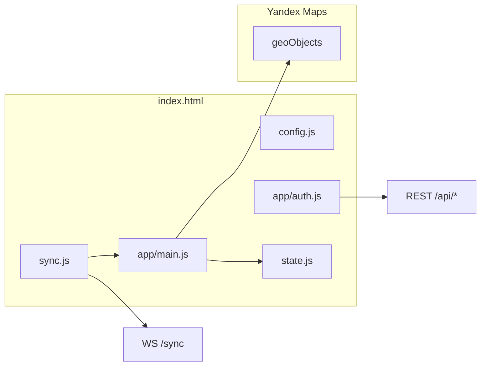

# Клиентская часть (frontend)

Статика в `public/`. Сборка не используется: скрипты подключаются тегами `<script>` в HTML. Глобальные переменные карты объявлены в `js/core/state.js`.

## Порядок загрузки (`index.html`)

Порядок важен: модули ниже по списку могут вызывать функции из модулей выше.

1. `js/core/config.js` — версия, `getApiBase()`
2. `js/app/auth.js` — сессия (до редиректов и API)
3. `js/core/state.js` — `myMap`, `objects`, режимы
4. `js/core/utils.js`, `script-loader.js`, `notifications.js`, `confirm-dialog.js`, `network-status.js`, `updates.js`
5. `js/groups.js` — группы кроссов/узлов
6. `js/map/theme.js`, `map-icons.js`, `cable-underground.js`, `regions.js`, `map-perf.js`, `search.js`
7. `js/fiber-cable-config.js`, `map-legend.js`
8. `js/app/main.js` — основная логика карты
9. `js/sync.js` — WebSocket (после инициализации карты)

Отложенная загрузка (через `script-loader.js`): `js/catalog/device-catalog.js`, `js/history.js`, `js/ui/help.js`, `js/ui/camera-player.js` и др. — см. `MAP_CORE_DEFERRED_SCRIPTS` / `MAP_UI_DEFERRED_SCRIPTS` в `script-loader.js`.

## Другие страницы

| Страница | Ключевые скрипты |
|----------|------------------|
| `auth.html` | `config.js`, `app/auth.js`, cookie-consent, maintenance, support-chat |
| `pricing.html`, `news.html` | `landing-nav.js`, page-bg-plexus, cookie-consent, support-chat |
| `site-admin.html` | `config.js`, `app/auth.js`, `admin/news-editor.js` |

Полный список файлов — [public/js/README.md](../public/js/README.md).

## Архитектура карты

- **Модель данных на клиенте:** массив `objects` — экземпляры `ymaps` (placemark, polyline, polygon) с `properties` (тип, `uniqueId`, связи).
- **Сериализация:** `getSerializedData()` в `main.js` для сохранения и sync.
- **Группы:** несколько кроссов/узлов в одной точке отображаются одним group-placemark (`updateCrossDisplay` / `updateNodeDisplay`).

## Синхронизация на клиенте

Файл `js/sync.js`:

- Подключение к `/sync`, debounce полного `state` (~400 ms)
- Инкрементальные операции: `syncSendOp` из `main.js` (`add_object`, `update_object`, `delete_*`, …)
- Курсоры: throttle ~120 ms
- Блокировки объектов при редактировании карточки

## Производительность карты

Модуль `js/map/map-perf.js`:

| Механизм | Назначение |
|----------|------------|
| `objectsById` | Поиск объекта по `uniqueId` за O(1) |
| `scheduleConnectionLinesUpdate` | Debounce пересборки линий ONU/OLT/сплиттер/узел |
| Инкрементальные группы | `updateCrossDisplay(key)` / `updateNodeDisplay(key)` — только затронутая точка |
| Viewport cull | При ≥120 объектах скрытие вне видимой области карты |
| Линии связи | Не рисуются при zoom &lt; 17 |

Пакетная загрузка при импорте ≥350 объектов: `MAP_BULK_IMPORT_*` в `main.js` (батчи через `requestAnimationFrame`).

## Стили

| Файл | Страницы |
|------|----------|
| `css/styles.css` | `index.html` |
| `css/app-mobile.css` | Карта, мобильная вёрстка |
| `css/auth.css` | auth, pricing, news |
| `css/landing.css`, `landing-header.css` | pricing, news |
| `css/site-admin.css` | site-admin |

Тема карты и UI: `js/map/theme.js`, CSS-переменные в `styles.css`.

## Соглашения

- Новые типы объектов: иконки в `js/map/map-icons.js`, фильтр в `main.js` (`applyMapFilter`)
- Уникальный id: `getObjectUniqueId()` + регистрация в `MapPerf.registerMapObject`
- Не вызывать `updateAllConnectionLines()` напрямую без необходимости — предпочтительно `scheduleConnectionLinesUpdate(uid)`
